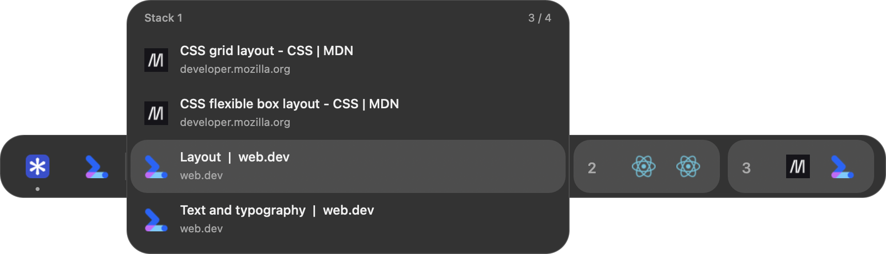
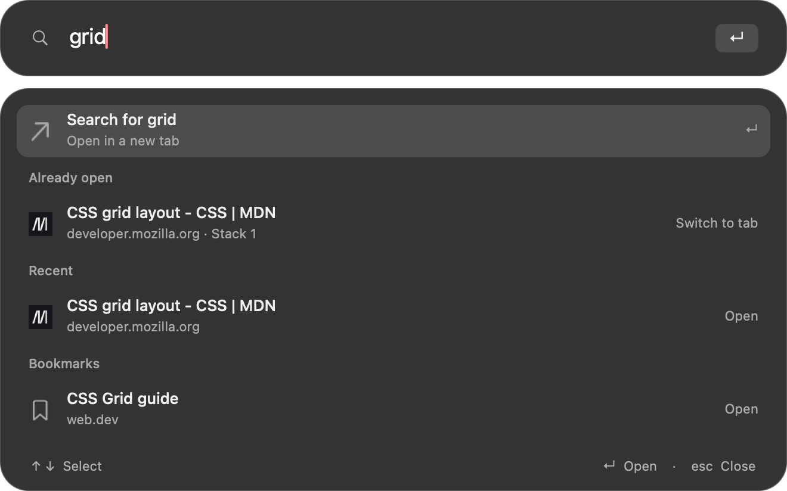

# Plico Helium Companion

Keyboard tab switching and tab groups for [Helium](https://helium.computer/) on macOS.

**Hold Command → select a tab → release to switch.** Keep the current page visible while choosing another tab. Organize related tabs into numbered stacks.

## Switch tabs

1. **Hold ⌘.** The navigator appears after 150 ms, or immediately on a navigation keystroke.
2. **Select a tab.** Use ←/→ or H/L across tabs and stacks; ↑/↓ or K/J within a stack. Selection wraps at either end.
3. **Release ⌘ to switch.** Esc cancels without switching.

The highlight marks your selection. The small dot marks the page currently open.

| Shortcut        | Action                                                                              |
| --------------- | ----------------------------------------------------------------------------------- |
| **⌘B**          | Keep the bar open. Repeat or tap ⌘ to switch; click a tab to switch with the mouse. |
| **Control+Tab** | Select recently used tabs. Add Shift to reverse; release Control to switch.         |
| **⌘W** / **⌘M** | Close / mute the selection immediately. Esc does not undo these actions.            |

## Organize tabs into stacks

Stacks are numbered Helium tab groups. New, ungrouped tabs sit on the left; stacks sit on the right.

| Shortcut                  | Action                                                                                      |
| ------------------------- | ------------------------------------------------------------------------------------------- |
| **⌘⇧ + arrows / H/J/K/L** | Move the selected tab left/right between tabs and stacks, or up/down within a stack.        |
| **⌘⇧1–9**                 | Move the tab into that stack; select the next tab in the original list to continue sorting. |
| **⌘1–9**                  | Select a stack's last visited tab.                                                          |

Release ⌘ to apply the moves and switch to the selection; Esc cancels. Up to ten stacks keep fixed numbers. Empty stacks are hidden. Stack 10 needs a custom shortcut; **⌘0** remains zoom reset.

[Stack navigation and sorting demo](docs/media/README.md#organize-tabs) · [Twelve-tab stack demo](docs/media/README.md#navigate-a-larger-stack)

## Search tabs, history, bookmarks and the web

**⌘T** opens search. Type, choose a result with ↑/↓, then press Enter. Open-tab results switch tabs; URLs and web searches open a new tab. Searches use Helium's default engine. Esc or clicking outside cancels without creating a tab.

**⌘;** edits the current URL. **⌘⇧C** copies it. [Search demo](docs/media/README.md#search-tabs)

[All controls, settings and tab indicators](docs/USAGE.md) · [All four demos](docs/media/README.md)

## Install

**0.4.0 is a private review candidate.** Installation builds the companion locally; there is no notarized app download yet.

Requires Helium and Apple's Command Line Tools. Tested on **macOS 26.6, Apple Silicon, Helium 0.17.2.2**.

1. Open Helium once. Install the tools if needed: `xcode-select --install`.
2. Clone this repository or extract its source ZIP, then open that folder in Terminal.
3. Run `bash Install.command`.
4. Follow the printed steps to load the extension and enable Accessibility for Plico.

Plico starts with Helium. Your profile and extensions stay in Helium; no browser modification or compilation is required.

[Installation, updates, rollback and uninstall](docs/INSTALLATION.md)

## Permissions and limitations

- Accessibility lets Plico handle shortcuts while the paired Helium window is focused.
- Tab/group information, history and bookmarks are read locally. The `debugger` permission only checks attachment status; Plico never attaches or sends debugger commands.
- macOS Secure Input in password fields can block movement shortcuts. Pinned-tab organization and more than ten groups per window are unsupported.
- Intel and other OS/browser versions are untested. Local-build updates may require granting Accessibility again.

[Permission details](SECURITY.md) · [Tests and known limits](docs/QUALIFICATION.md)

## Development

AppKit interface, C++ navigation model and a Manifest V3 extension connected through native messaging.

[Build and test](docs/DEVELOPMENT.md) · [Architecture](docs/ARCHITECTURE.md) · [Changelog](CHANGELOG.md) · [GPL-3.0 license](LICENSE)

The navigation model and gesture router come from [plico](https://github.com/1Pio/plico), GPL-3.0-only. Independent of the Helium project.
