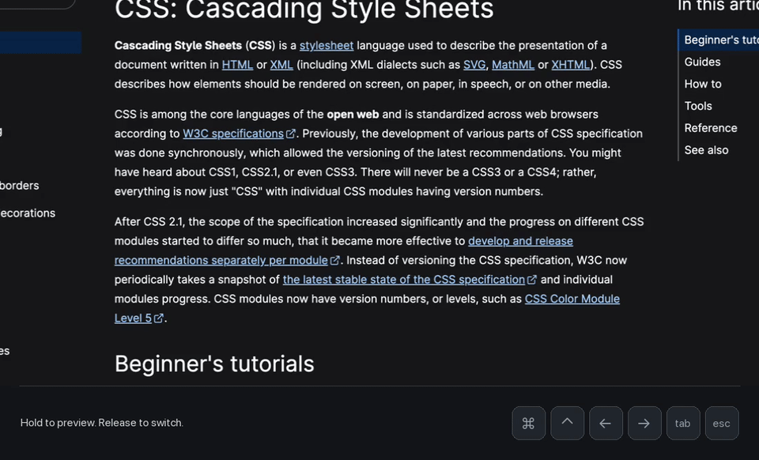
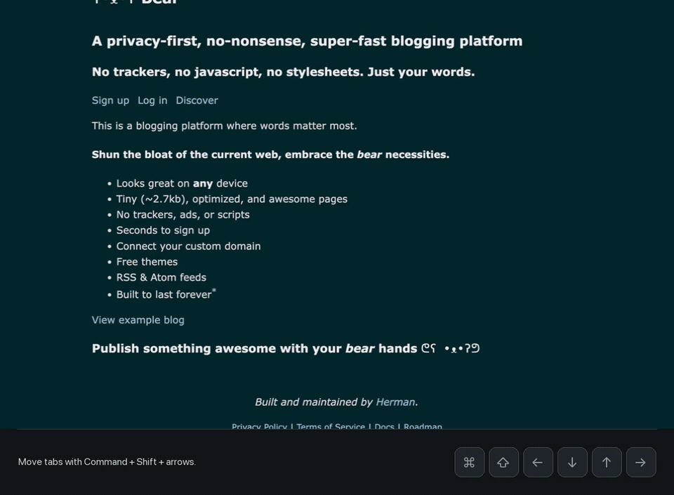
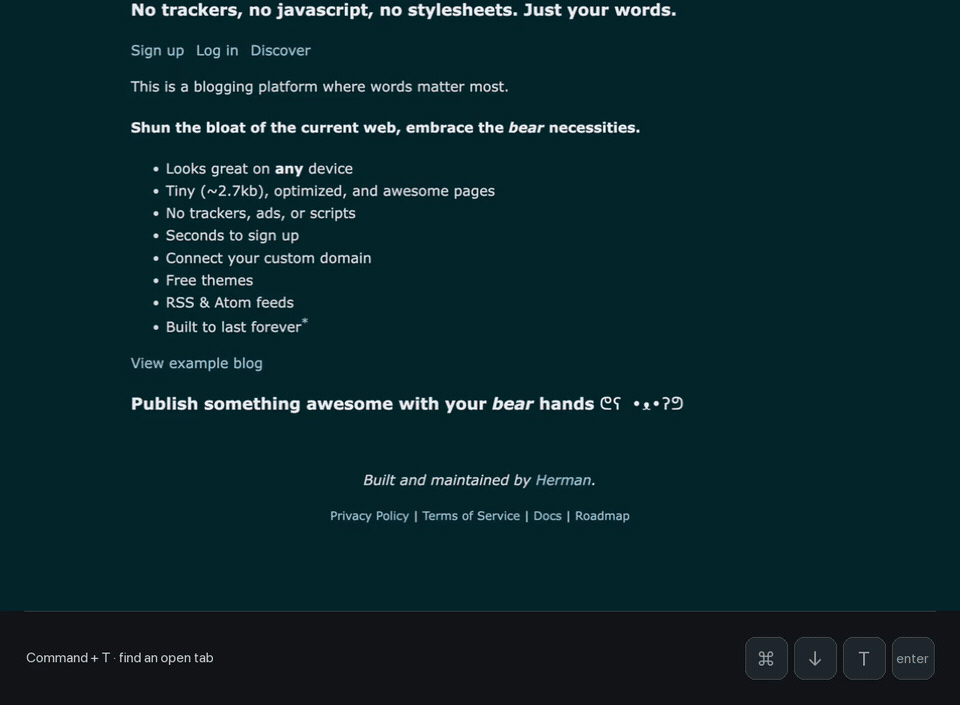
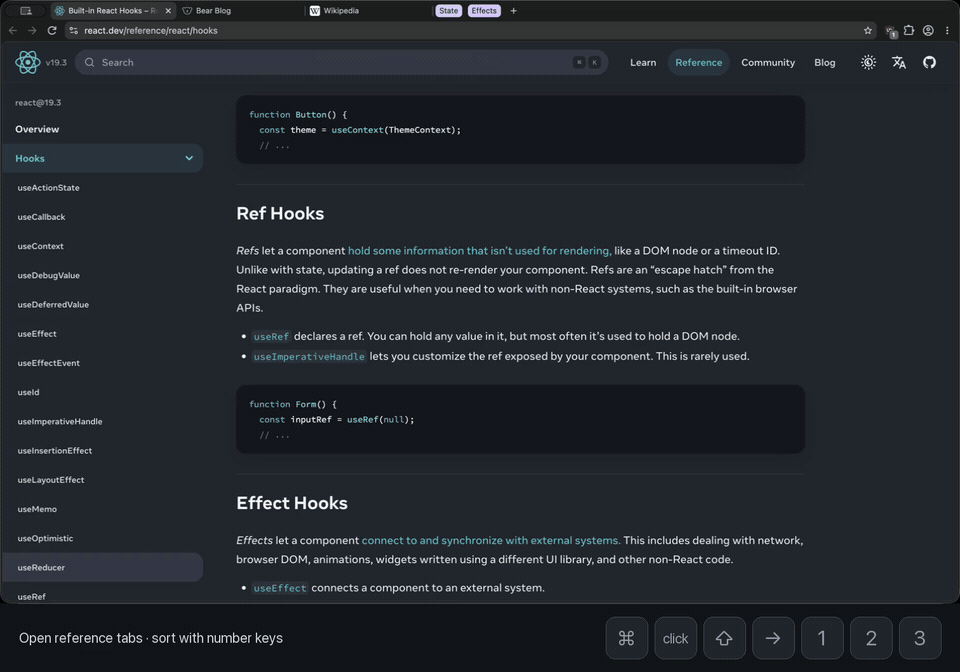

# Demos

These animated previews play directly in GitHub's Markdown view. The MP4 links download the full-quality, 60 fps recordings.

## Switch tabs

Hold Command, select another tab, then release to switch. Escape cancels a selection. Control+Tab selects recently used tabs.

[Download MP4 · 540 KB](navigation.mp4?raw=true)

## Organize tabs

Move within a stack, return to its last visited tab, and sort ungrouped tabs into a stack without following them.

[Download MP4 · 1.1 MB](stacks.mp4?raw=true)

## Search tabs

Press Command+T, type a query and select an already-open tab.

[Download MP4 · 472 KB](composer.mp4?raw=true)

## Navigate a larger stack

Scroll through a twelve-tab stack, jump between stacks, and cancel a selection with Escape.

[Download MP4 · 746 KB](busy.mp4?raw=true)

## Recording details

Recorded in stock Helium with the shipping Plico extension, an isolated profile and public documentation pages. Input is synthetic; the key overlays follow actual shortcut down/up timestamps. Text entry appears in the real field. The recordings are silent and contain no personal browsing.

The footer is added for the demos. GIFs use 20 fps; MP4s retain 60 fps. Unused tails are trimmed, and the first clip uses a fixed detail crop. No interactions are sped up or fabricated.

Pages and favicons: [MDN Web Docs](https://developer.mozilla.org/), [web.dev](https://web.dev/), [React](https://react.dev/), [Helium](https://helium.computer/) and [Helium on GitHub](https://github.com/imputnet/helium). Their appearance does not imply endorsement.

[Runtime tests and limitations](../QUALIFICATION.md)
